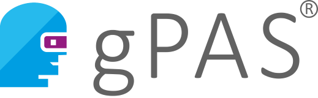
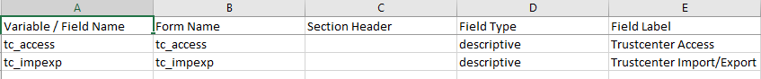

# REDCap module to integrate E-PIX / gPAS for (de-)pseudonymisation

This modul uses these components:

*  E-PIX: https://www.ths-greifswald.de/forscher/e-pix/ 

*  gPAS: https://www.ths-greifswald.de/forscher/gpas/

* SAP search: it uses the SAP BAPI_PATIENT_SEARCH Function Module for IS-H BAPI Patient.Search (see [WSDL](docs/wsdl_sap.xml))

* The authorisation of the REDCap user uses OIDC authorization code flow.

## Prerequisites
- REDCap with external modules framework (>= v.8.0.0)
- E-PIX server
- gPAS server
- SAP API for searching patients
- API Gateway for secure access to APIs with OIDC

## Installation
- Unzip the module to the modules directory (folder name pseudo_service_vX.X.X)
- Go to **Control Center > External Modules > Manage** and enable the module
- For each project you want to use this module, go to the project home page, click on **External Modules > Manage**, and then enable the module for that project.

## System Configuration

| Parameter             | Description                            |
|-----------------------|-----------------------------------------|
| allowed REDCap domain | allowed REDCap hostname              |
| E-PIX API URL         | API URL for E-PIX                  |
| E-PIX Domain          | E-PIX domain                            |
| E-PIX external source | source for external persons   |
| E-PIX ID Domain       | ID domain                               |
| E-PIX safe source     | safe source for patients from SAP       |
| E-PIX Scope           | E-PIX Scope (OIDC)               |
| gPAS API URL          | API URL for gPAS                   |
| gPAS Domain API URL   | API URL for gPAS Domain Manager    |
| gPAS Domain Scope     | gPAS Domains Scope (OIDC)       |
| gPAS Scope            | gPAS Scope (OIDC)                |
| OAuth2 Client ID      | Client ID for OIDC Authentification    |
| OAuth2 Client secret  | Secret for OIDC Authentification       |
| SAP API URL           | API URL SAP search              |
| SAP Scope             | SAP search Scope (OIDC)          |
| use proxy             | use REDCap system proxy for http(s) |

## Project Configuration

- gPAS domain: specifiy gPAS domain for creating studyIDs
- additional fields for setting the user rights for specific roles:
  
